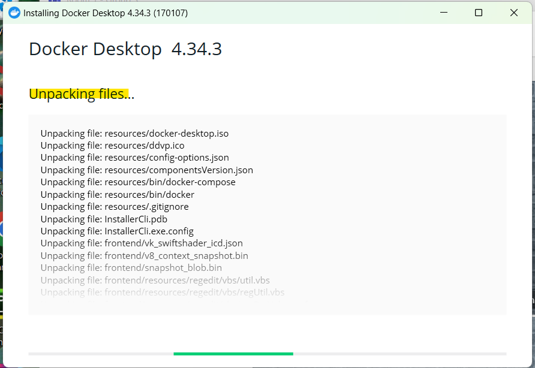

# tech264-docker-kubernetes

- [tech264-docker-kubernetes](#tech264-docker-kubernetes)
- [Install Docker Desktop on your local machine](#install-docker-desktop-on-your-local-machine)
  - [Installing Docker Desktop](#installing-docker-desktop)
  - [Verify Docker Installation](#verify-docker-installation)
  - [Check Docker Desktop Status](#check-docker-desktop-status)
  - [Create Docker Hub Account \& Log in](#create-docker-hub-account--log-in)
- [Differences between virtualisation and containerisation](#differences-between-virtualisation-and-containerisation)
  - [Virtualisation vs. Containerisation](#virtualisation-vs-containerisation)
  - [Virtualisation](#virtualisation)
    - [Benefits](#benefits)
  - [Containerisation](#containerisation)
    - [Benefits](#benefits-1)
  - [Key Differences](#key-differences)
    - [Comparison Table: Virtualisation vs. Containerisation](#comparison-table-virtualisation-vs-containerisation)
- [Microservices](#microservices)
  - [What Are Microservices?](#what-are-microservices)
  - [How Are They Made Possible?](#how-are-they-made-possible)
    - [Benefits of Microservices](#benefits-of-microservices)
- [Docker](#docker)
  - [What Is Docker?](#what-is-docker)
  - [Alternatives to Docker](#alternatives-to-docker)
    - [How Docker Works (Docker Architecture/API)](#how-docker-works-docker-architectureapi)
  - [Success Story Using Docker](#success-story-using-docker)
    - [Concepts](#concepts)


# Install Docker Desktop on your local machine
Install Docker Desktop

Once installed:
* In a terminal window, run docker --version, and paste the output in the chat. From v20 onwards is fine.
* Run Docker Desktop application and check the bottom left for the status.

:information_source: Note:

* Status should be green and the newer versions also state "Engine running".
* If the status is not green, you will need to troubleshoot to get it running.

:warning: Warning! When starting Docker Desktop in Windows, you will likely need to choose to "Run as Administrator". If you don't, you will get an error.

* Create an account on Docker Hub. Doesn't matter the OS you are using on your local machine.
* In Docker Desktop, login using the account you created on Docker Hub.

<br>

## Installing Docker Desktop
Source: https://docs.docker.com/desktop/install/windows-install/
* Follow the installation prompts. On Windows, you may need to allow permissions and select "Run as Administrator."




## Verify Docker Installation
* Once Docker Desktop is installed, open a terminal (Command Prompt, PowerShell, or your OS's terminal).
* Open a fresh Git Bash terminal. 
* Run the following command: `docker --version`
* This should display Docker’s version number. Look for a version from 20 onwards.

```bash
Docker version 27.2.0, build 3ab4256
```

* It will ask to restard your desktop.


## Check Docker Desktop Status
* Launch Docker Desktop (view in downloads).
* Look at the bottom left corner for Docker’s status indicator.
  * A green status and “Engine running” text indicate that Docker is functioning properly.


* If you see a different status, troubleshoot using Docker’s support resources or ensure Docker Desktop has the necessary permissions to run.

## Create Docker Hub Account & Log in
* Go to Docker Hub and create an account if you haven’t already.
* My username: gina98
* Open Docker Desktop and log in with the Docker Hub account credentials.

<br>

# Differences between virtualisation and containerisation

## Virtualisation vs. Containerisation
Virtualisation and containerisation are both ways to create isolated environments for running applications, but they differ in their approach and structure.

## Virtualisation
**How It Works**
* In virtualisation, a physical machine runs a hypervisor, which is software that creates multiple virtual machines (VMs). 
* Each VM has its own operating system and resources.

**What's in a VM?**
* Each virtual machine includes a full OS, libraries, dependencies, and the application itself.

### Benefits
**Isolation**: VMs are fully isolated, which increases security and reliability.
**Resource Allocation**: You can allocate specific CPU, memory, and storage resources to each VM.
**Compatibility**: Each VM can run different OSes, making it flexible for various applications.

## Containerisation
**How It Works**
* Containers package up just the application code and dependencies but share the host OS kernel. 
* Instead of a hypervisor, containers use a container runtime like Docker to manage isolation.

**What's in a Container?**
* A container usually includes only the application, necessary libraries, and dependencies—no separate OS.

### Benefits
* **Lightweight**: Containers don’t need an entire OS, making them smaller and faster to start up.
* **Consistency**: Containers ensure that applications run the same, regardless of where they are deployed.
* **Scalability**: Containers are more efficient in terms of resource use, so you can run more containers on the same hardware compared to VMs.

## Key Differences
* **Size**: Containers are much lighter than VMs as they share the host OS kernel.
* **Startup Time**: Containers start almost instantly, whereas VMs can take several minutes.
* **Isolation**: VMs provide stronger isolation since each VM has its own OS, while containers share the host OS.

<br>

### Comparison Table: Virtualisation vs. Containerisation

| Aspect           | Virtualisation                            | Containerisation                       |
|------------------|------------------------------------------|----------------------------------------|
| **Isolation**    | Full OS per VM                           | Shared OS kernel, isolated space       |
| **Resource Usage** | Higher resource usage                  | Lower resource usage                   |
| **Startup Time** | Slower                                   | Almost instant                         |
| **Use Cases**    | Legacy applications, multiple OS types   | Microservices, cloud-native apps       |


<br>

# Microservices
* Microservices are an architectural style where applications are broken down into small, independent services that each handle a specific function.

## What Are Microservices?
* Microservices are small, self-contained services that communicate with each other through APIs.
* Each microservice is responsible for a specific function, like user authentication, payment processing, or inventory management.

## How Are They Made Possible?
* Microservices are enabled by containerisation tools like Docker, which allow each service to be isolated and packaged separately.
* Communication between microservices is typically handled by APIs, making it easier to scale and update parts of an application without affecting others.

### Benefits of Microservices
* **Scalability**: You can scale individual services based on demand, without affecting other parts of the application.
* **Flexibility**: Different microservices can be written in different languages or use different frameworks.
* **Resilience**: If one microservice fails, it doesn’t bring down the entire application.

<br>

# Docker
* Docker is a popular platform for developing, shipping, and running applications in containers. 
* It automates the deployment of applications by packaging them with everything they need to run.

## What Is Docker?
* Docker is a containerisation tool that simplifies application development by creating lightweight, isolated environments.
* It provides a standardised way to build, share, and run containers, making it easier to work across different environments (e.g., development, testing, production).

## Alternatives to Docker
* **Kubernetes**: A container orchestration tool that manages containers across multiple hosts. Often used with Docker.
* **Podman**: Similar to Docker but without requiring a daemon, allowing for rootless containers.
* **LXC** (Linux Containers): An older container technology, more like traditional VMs.
* **rkt** (Rocket): A container runtime developed by CoreOS, now less popular.

### How Docker Works (Docker Architecture/API)
Docker’s architecture consists of several key components:

* **Docker Engine**: The core software that runs and manages containers. It has two parts:
  * **Docker Daemon**: Runs on the host machine and manages the containers.
  * **Docker CLI**: A command-line interface to interact with Docker.
* **Docker Images**: A read-only template that defines the container. 
  * Each image is built from a Dockerfile, which specifies the OS, dependencies, and application.
* **Docker Containers**: Instances of Docker images that can be run, stopped, and removed as needed.
* **Docker Hub**: A public repository for sharing and downloading container images.

## Success Story Using Docker
Example: Spotify

* **Challenge**: Spotify needed to scale its application to millions of users across many devices while maintaining high reliability and quick feature delivery.
* **Solution with Docker**: Spotify adopted Docker for its microservices architecture, using it to package each service independently. 
  * This allowed the team to release updates frequently without disrupting the user experience.
* **Outcome**: Docker helped Spotify reduce deployment times, maintain consistency across environments, and scale its services efficiently to handle global traffic.

### Concepts

| Concept          | Description                                                                             |
|------------------|-----------------------------------------------------------------------------------------|
| **Microservices**| Independent services focused on specific tasks, made possible by containers and APIs.   |
| **Docker**       | A containerisation platform that makes it easy to create, share, and deploy containers. |
| **Docker Engine**| The core of Docker, managing images and containers.                                     |
| **Docker Hub**   | A repository for Docker images, enabling easy sharing and deployment of containerised applications. |

Docker and microservices offer agility, consistency, and scalability, which is why they are widely used in modern software development.

<br>