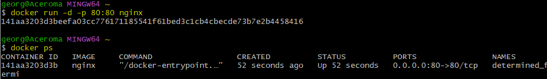

- [Install Docker Desktop on your local machine](#install-docker-desktop-on-your-local-machine)
  - [Installing Docker Desktop](#installing-docker-desktop)
  - [Verify Docker Installation](#verify-docker-installation)
  - [Check Docker Desktop Status](#check-docker-desktop-status)
  - [Create Docker Hub Account \& Log in](#create-docker-hub-account--log-in)
- [Differences between virtualisation and containerisation](#differences-between-virtualisation-and-containerisation)
  - [Virtualisation vs. Containerisation](#virtualisation-vs-containerisation)
  - [Virtualisation](#virtualisation)
    - [Benefits](#benefits)
  - [Containerisation](#containerisation)
    - [Benefits](#benefits-1)
  - [Key Differences](#key-differences)
    - [Comparison Table: Virtualisation vs. Containerisation](#comparison-table-virtualisation-vs-containerisation)
- [History of Running Software: Traditional, Virtualisation, and Containerisation](#history-of-running-software-traditional-virtualisation-and-containerisation)
  - [Traditional Deployment](#traditional-deployment)
  - [Virtualisation](#virtualisation-1)
  - [Containerisation](#containerisation-1)
  - [When to choose?](#when-to-choose)
- [Microservices](#microservices)
  - [What Are Microservices?](#what-are-microservices)
  - [How Are They Made Possible?](#how-are-they-made-possible)
    - [Benefits of Microservices](#benefits-of-microservices)
- [🐳Docker](#docker)
  - [What Is Docker?](#what-is-docker)
  - [Alternatives to Docker](#alternatives-to-docker)
    - [How Docker Works (Docker Architecture/API)](#how-docker-works-docker-architectureapi)
  - [Success Story Using Docker](#success-story-using-docker)
    - [Concepts](#concepts)
- [How Docker Works](#how-docker-works)
  - [Docker Host](#docker-host)
  - [Docker CLI (Client)](#docker-cli-client)
  - [Docker Hub (Registry)](#docker-hub-registry)
  - [Running Containers](#running-containers)
  - [Pulling Images Manually](#pulling-images-manually)
    - [Summary](#summary)
- [Tuesday Code-Along, 05/11](#tuesday-code-along-0511)
  - [docker run](#docker-run)
    - [Why Specify Ports](#why-specify-ports)
  - [How to stop this container](#how-to-stop-this-container)
  - [Start and remove a container](#start-and-remove-a-container)
  - [Change a container from the inside](#change-a-container-from-the-inside)
  - [Change something inside the container](#change-something-inside-the-container)
    - [Edit the index .html file](#edit-the-index-html-file)
  - [Run a container on a different port](#run-a-container-on-a-different-port)
- [Push host-custom-static-webpage container image to Docker Hub](#push-host-custom-static-webpage-container-image-to-docker-hub)
  - [Step 1: Commit the Running Container as an Image](#step-1-commit-the-running-container-as-an-image)
  - [Step 2: Log in to Docker Hub](#step-2-log-in-to-docker-hub)
  - [Step 3: Push the Image to Docker Hub](#step-3-push-the-image-to-docker-hub)
  - [Step 4: Test the Image from Docker Hub](#step-4-test-the-image-from-docker-hub)
  - [Step 5: Test on the Browser](#step-5-test-on-the-browser)
- [Automate docker image creation using a Dockerfile](#automate-docker-image-creation-using-a-dockerfile)
  - [Step 1: Set Up the Folder Structure](#step-1-set-up-the-folder-structure)
    - [Alternative: Using Visual Studio Code](#alternative-using-visual-studio-code)
  - [Step 2: Write the Dockerfile](#step-2-write-the-dockerfile)
  - [Step 3: Build the Custom Docker Image](#step-3-build-the-custom-docker-image)
  - [Step 4: Run the Container](#step-4-run-the-container)
  - [Step 5: Push the Image to Docker Hub](#step-5-push-the-image-to-docker-hub)
  - [Step 6: Run Command](#step-6-run-command)
  - [Check your browser!](#check-your-browser)
- [Run Sparta test app in a container](#run-sparta-test-app-in-a-container)
  - [Step 1: Create Dockerfile \& Add App Folder](#step-1-create-dockerfile--add-app-folder)
  - [Step 2: Build the Docker Container](#step-2-build-the-docker-container)
    - [Explanation](#explanation)
  - [Step 3: Run the Docker Container](#step-3-run-the-docker-container)
  - [Step 4: Push the Image to Docker Hub](#step-4-push-the-image-to-docker-hub)
  - [Step 5: Check your browser!](#step-5-check-your-browser)
- [Research Docker Compose](#research-docker-compose)
  - [What is Docker Compose?](#what-is-docker-compose)
  - [Why Use Docker Compose?](#why-use-docker-compose)
  - [How to Use Docker Compose](#how-to-use-docker-compose)
  - [What Do You Need to Install for Docker Compose to Work?](#what-do-you-need-to-install-for-docker-compose-to-work)
  - [Where to Store Your Docker Compose File](#where-to-store-your-docker-compose-file)
  - [Difference Between Detached and Non-Detached Mode](#difference-between-detached-and-non-detached-mode)
  - [Key Docker Compose Commands](#key-docker-compose-commands)
- [Use Docker Compose to Manage Multi-Container Docker Applications](#use-docker-compose-to-manage-multi-container-docker-applications)
  - [Step 1: Ensure Images Are Available](#step-1-ensure-images-are-available)
  - [Step 2: Create docker-compose.yml](#step-2-create-docker-composeyml)
  - [Step 3: Run the Application with Docker Compose](#step-3-run-the-application-with-docker-compose)
  - [Step 4: Verify the Setup](#step-4-verify-the-setup)
  - [Step 5: Seeding the Database](#step-5-seeding-the-database)
    - [Manual Seeding](#manual-seeding)
    - [Automatic Seeding](#automatic-seeding)


# Install Docker Desktop on your local machine

Once installed:
* In a terminal window, run docker --version, and paste the output in the chat. From v20 onwards is fine.
* Run Docker Desktop application and check the bottom left for the status.

:information_source: Note:

* Status should be green and the newer versions also state "Engine running".
* If the status is not green, you will need to troubleshoot to get it running.

:warning: Warning! When starting Docker Desktop in Windows, you will likely need to choose to "Run as Administrator". If you don't, you will get an error.

* Create an account on Docker Hub. Doesn't matter the OS you are using on your local machine.
* In Docker Desktop, login using the account you created on Docker Hub.

<br>

## Installing Docker Desktop
Source: https://docs.docker.com/desktop/install/windows-install/
* Follow the installation prompts. On Windows, you may need to allow permissions and select "Run as Administrator."


## Verify Docker Installation
* Once Docker Desktop is installed, open a terminal (Command Prompt, PowerShell, or your OS's terminal).
* Open a fresh Git Bash terminal. 
* Run the following command: `docker --version`
* This should display Docker’s version number. Look for a version from 20 onwards.

```bash
Docker version 27.2.0, build 3ab4256
```

* It will ask to restart your desktop.


## Check Docker Desktop Status
* Launch Docker Desktop (view in downloads).
* Look at the bottom left corner for Docker’s status indicator.
  * A green status and “Engine running” text indicate that Docker is functioning properly.


* If you see a different status, troubleshoot using Docker’s support resources or ensure Docker Desktop has the necessary permissions to run.

## Create Docker Hub Account & Log in
* Go to Docker Hub and create an account if you haven’t already.
* My username: gina98
* Open Docker Desktop and log in with the Docker Hub account credentials.

<br>

# Differences between virtualisation and containerisation


Source: https://www.bmc.com/blogs/containers-vs-virtual-machines/

<br>

## Virtualisation vs. Containerisation
Virtualisation and containerisation are both ways to create isolated environments for running applications, but they differ in their approach and structure.

## Virtualisation
**How It Works**
* In virtualisation, a physical machine runs a hypervisor, which is software that creates multiple virtual machines (VMs). 
* Each VM has its own operating system and resources.

**What's in a VM?**
* Each virtual machine includes a full OS, libraries, dependencies, and the application itself.


Source: https://www.researchgate.net/figure/Generic-Virtualization-Architecture-based-on-56_fig3_366198104

### Benefits
* **Isolation**: VMs are fully isolated, which increases security and reliability.
* **Resource Allocation**: You can allocate specific CPU, memory, and storage resources to each VM.
* **Compatibility**: Each VM can run different OS's, making it flexible for various applications.

<br>

## Containerisation
**How It Works**
* Containers package up just the application code and dependencies but share the host OS kernel. 
* Instead of a hypervisor, containers use a container runtime like Docker to manage isolation.

**What's in a Container?**
* A container usually includes only the application, necessary libraries, and dependencies—no separate OS.


<br>

### Benefits
* **Lightweight**: Containers don’t need an entire OS, making them smaller and faster to start up.
* **Consistency**: Containers ensure that applications run the same, regardless of where they are deployed.
* **Scalability**: Containers are more efficient in terms of resource use, so you can run more containers on the same hardware compared to VMs.

## Key Differences
* **Size**: Containers are much lighter than VMs as they share the host OS kernel.
* **Startup Time**: Containers start almost instantly, whereas VMs can take several minutes.
* **Isolation**: VMs provide stronger isolation since each VM has its own OS, while containers share the host OS.

<br>

### Comparison Table: Virtualisation vs. Containerisation

| Aspect           | Virtualisation                            | Containerisation                       |
|------------------|------------------------------------------|----------------------------------------|
| **Isolation**    | Full OS per VM                           | Shared OS kernel, isolated space       |
| **Resource Usage** | Higher resource usage                  | Lower resource usage                   |
| **Startup Time** | Slower                                   | Almost instant                         |
| **Use Cases**    | Legacy applications, multiple OS types   | Microservices, cloud-native apps       |


<br>

# History of Running Software: Traditional, Virtualisation, and Containerisation


Source: https://www.linkedin.com/pulse/traditional-deployment-vs-virtualization-container-chinnayya-chintha-vmk2c/

<br>

## Traditional Deployment
* Early on, organisations ran applications on physical servers.
* Install or use an existing operating system.
* Install the tools & dependencies needed by your software.
* Run your application on it.

Cons of Traditional Deployment:
* In the issue of resource isolation, there is no way to define resource boundaries for applications in a physical server.
* Scaling issues for specific applications and long downtime.
* Over-utilisation of resources for a specific app can crash the entire physical server.
* It was expensive for organisations to maintain many physical servers.

To overcome this problem, a virtual machine was introduced.

<br>

## Virtualisation
* Virtualisation is a process where software is used to create an abstract layer. So VM's that abstract layer or software is called Hypervisor.
* Hypervisor simplify something—something that helps a virtual machine emulate a physical computer.
* Hypervisor is software responsible for creating, managing and running these virtual machines. It also manages the allocation of resources between VM's on that single physical host.
* Now each VM runs its own operating system and has its own virtual hardware, like virtual CPU, storage, etc.

Cons of Virtualisation:
* Operating system images are heavyweight; image size is in GB. 
Contain guest OS for each virtual machine. 
It is a slow-to-boot-up process.

Real-time use cases of Virtualisation:
* Diverse Operating System(o/s)
* Legacy & Isolation Applications

<br>

## Containerisation
* Docker is an **open source** platform that enables developers to build, deploy, run, update and manage containers—standardised, executable components that combine application source code with the operating system (OS) libraries and dependencies required to run that code in any environment.
* Docker container virtualise the operating system. 
  * So each individual container contains only the application and it's libraries and dependencies.
* Docker Engine is core software that's responsible for managing the life cycle of docker container and providing infrastructure for creating, runningand orchestrating containers.
* In Docker Engine, Cgroups or Control groups, is responsible for **allocating resources among the processes**, and Namespaces (n/s)  restrict container access and visibility to other resources on the system.
* Docker Images are light weight, standalone and executable packages that include everything you need to run a piece of software.
* Docker Images are built using Dockerfile, which are simple document that provide instructions to creating the image.
* Docker containers are runtime instances of images that run in docker engine. Each container is an isolated and self-sufficient environment that includes only the necessary components of running specific application and can be easily started, stopped and restarted.

Real-time use cases of Containerisation:
* Ideal for portability, scalability, and microservice architectures.
* Containers package applications with dependencies into a single unit.
* Rapid development, deployment & Resource Efficiency

When to Choose
* **Traditional Deployment**: Fine-grained control, customisation.
* **Virtualisation**: workload consolidation, resource optimisation.
* **Containerisation**: portability, scalability, lightweight deployment.

<br>

## When to choose?


Source: https://blog.bytebytego.com/p/virtualization-and-containerization

<br>

# Microservices
* Microservices are an architectural style where applications are broken down into small, independent services that each handle a specific function.

## What Are Microservices?
* Microservices are an architectural style where applications are broken down into small, independent services that each handle a specific function.
* Microservices are small, self-contained services that communicate with each other through APIs.
* Each microservice is responsible for a specific function, like user authentication, payment processing, or inventory management.

## How Are They Made Possible?
* Microservices are enabled by containerisation tools like Docker, which allow each service to be isolated and packaged separately.
* Docker containers encapsulate the application code, libraries, and dependencies, ensuring that each microservice runs consistently across different environments. 
* Communication between microservices is typically handled by APIs, making it easier to scale and update parts of an application without affecting others.

### Benefits of Microservices
* **Scalability**: You can scale individual services based on demand, without affecting other parts of the application.
* **Flexibility**: Different microservices can be written in different languages or use different frameworks.
* **Resilience**: If one microservice fails, it doesn’t bring down the entire application.


<br>

# 🐳Docker
* Docker is a popular platform for developing, shipping, and running applications in containers. 
* It automates the deployment of applications by packaging them with everything they need to run.

## What Is Docker?
* Docker is a containerisation tool that simplifies application development by creating lightweight, isolated environments.
* It provides a standardised way to build, share, and run containers, making it easier to work across different environments (e.g., development, testing, production).

## Alternatives to Docker
* **Kubernetes**: A container orchestration tool that manages containers across multiple hosts. Often used with Docker.
* **Podman**: Similar to Docker but without requiring a daemon, allowing for rootless containers.
* **LXC** (Linux Containers): An older container technology, more like traditional VMs.
* **rkt** (Rocket): A container runtime developed by CoreOS, now less popular.

### How Docker Works (Docker Architecture/API)
Docker’s architecture consists of several key components:

* **Docker Engine**: The core software that runs and manages containers. It has two parts:
  * **Docker Daemon**: Runs on the host machine and manages the containers.
  * **Docker CLI**: A command-line interface to interact with Docker.
* **Docker Images**: A read-only template that defines the container. 
  * Each image is built from a Dockerfile, which specifies the OS, dependencies, and application.
* **Docker Containers**: Instances of Docker images that can be run, stopped, and removed as needed.
* **Docker Hub**: A public repository for sharing and downloading container images.


<br>

## Success Story Using Docker
Example: Spotify🎶 

* **Challenge**: Spotify needed to scale its application to millions of users across many devices while maintaining high reliability and quick feature delivery.
* **Solution with Docker**: Spotify adopted Docker for its microservices architecture, using it to package each service independently. 
  * This allowed the team to release updates frequently without disrupting the user experience.
* **Outcome**: Docker helped Spotify reduce deployment times, maintain consistency across environments, and scale its services efficiently to handle global traffic.

### Concepts

| Concept          | Description                                                                             |
|------------------|-----------------------------------------------------------------------------------------|
| **Microservices**| Independent services focused on specific tasks, made possible by containers and APIs.   |
| **Docker**       | A containerisation platform that makes it easy to create, share, and deploy containers. |
| **Docker Engine**| The core of Docker, managing images and containers.                                     |
| **Docker Hub**   | A repository for Docker images, enabling easy sharing and deployment of containerised applications. |

Docker and microservices offer agility, consistency, and scalability, which is why they are widely used in modern software development.

<br>

# How Docker Works


## Docker Host
* This is the machine where Docker is installed. 
* It runs the Docker Daemon (server), which is responsible for managing Docker containers, images, networks, and storage volumes. 
* The Docker Daemon listens for Docker API requests and manages Docker objects.

## Docker CLI (Client)
* The Docker Command Line Interface (CLI) is a tool that allows users to interact with the Docker Daemon using commands. 
* These commands use an API to communicate with the Docker Daemon, enabling users to manage containers, images, networks, and volumes.

## Docker Hub (Registry)
* Docker Hub is a cloud-based registry service where Docker images are stored. 
* It acts as a central repository for Docker images, allowing users to share and access container images. 
* Docker Hub stores all the files needed to run a container, such as the application code, libraries, and dependencies.

## Running Containers
`docker run (image name)`
* This command is used to create and start a container from a specified image. 
* When you run this command, Docker checks if the image is available locally. 
* If the image is not found locally, Docker will pull it from Docker Hub.

  * **Image Check**: If the specified image is not available locally, Docker Daemon will check Docker Hub to see if the image exists.
  * **Image Pull**: If the image is found on Docker Hub, Docker will download (pull) the image to the local machine.
  * **Container Start**: Once the image is available locally, Docker will create and start a container from the image.

## Pulling Images Manually
`docker pull (image name)`
* This command is used to manually download an image from a remote repository (e.g., Docker Hub) to the local machine. 
* This is useful if you want to ensure that the image is available locally before running a container.

### Summary
* Docker simplifies the process of building, deploying, and running applications by using containers. 
* The Docker Host runs the Docker Daemon, which manages containers and images. 
* The Docker CLI allows users to interact with the Docker Daemon using commands. 
* Docker Hub serves as a central repository for Docker images. 
* When running a container, Docker checks if the image is available locally and pulls it from Docker Hub if necessary. 
* This streamlined process ensures that applications run consistently across different environments.

<br>

# Tuesday Code-Along, 05/11
* Open Git Bash window. 
* `docker --help`: to help you with Docker commands.
* Check what Docker images you already have: `docker images`
  * The output is the headings of the columns. 
    * repository, tag, image id, created, size.


* If you have a permission error, try:
  * Go to Windows search bar and type "Git Bash"
  * Click "Run as administrator".


<br> 

* Test: `docker run hello-world`
  * It created the container and is designed to stop running once it's done. 


* If you go onto your Docker Desktop, you'll notice a container has been created.


<br> 

* Check if any containers are running.
  * `docker ps`
  * You'll notice nothing is running. 


<br>

## docker run
`docker run -d -p 80:80 nginx`
* `-d`: Detached mode. This option runs the container in the background.
* `-p`: Port mapping. This option specifies the ports to be used for this container, both inside and outside.
* `80:80`: Maps port 80 on the host to port 80 on the container. This is useful if you want to expose the container's service on a specific port.
* `Nginx`: The container image you want to run. In this case, it's the Nginx web server.

Explanation: 

Detached Mode (`-d`):
* Runs the container in the background, allowing you to continue using the terminal for other commands.

Port Mapping (`-p`):
* `80:80`: The first 80 is the host port, and the second 80 is the container port. 
* This means that any traffic to port 80 on the host will be forwarded to port 80 on the container.

### Why Specify Ports
* Containers are often designed to run specific services or applications. 
* By mapping ports, you can control how these services are accessed from outside the container. 
* This is particularly useful if you want to run multiple servers on different ports.

Specify the Image:
* `nginx`: The name of the Docker image you want to run. 
* If the image is not available locally, Docker will pull it from Docker Hub.


* You can check it's running on your Docker Desktop.


<br>

* Check it's running with: `docker ps`


* If you go to a web browser and type 'localhost' where you would your URL, you will see the nginx page.


<br>

## How to stop this container
  * You can use the container ID or the Name. 
  * `docker stop d18152c4c45c` or `docker stop sleepy_wu`


* `docker ps --help`
  * To get help on different types of docker ps commands.

* To get a list of containers:
  * `docker ps -a`


<br>

## Start and remove a container
  * `docker start sleepy_wu` (insert container name or id)

* Removing the container is different to removing the image.
  * When you remove a container, you are deleting the container instance, but the image it was created from remains intact.

* Remove a container:
  * `docker rm sleepy_wu` (insert container name or id)


* Error: you can either forcefully remove it or stop it running before you remove it. 
  * `docker rm --help`


* `docker rm sleepy_wu -f`
* `docker ps` to check if it's been removed.


<br>

## Change a container from the inside

* Run the container again (becuase we've deleted it). 
  * `docker run -d -p 80:80 nginx`
  * `docker ps`: to check it's running. 



  * Refresh web browser with local host running (to check nginx is running).
  * `docker exec -it determined_fermi sh` 
    * -i: Interactive mode.
    * t: Allocate a terminal.
      * A pseudo-TTY (pseudo-terminal) is a software interface that emulates a physical terminal. 
      * It allows programs to interact with the terminal as if they were connected to a real terminal device. 
      * In the context of Docker, a pseudo-TTY is used to provide an interactive shell session within a container.
    * name of the container.
    * sh: Shell to be used inside the container.


*Note! This will give you the following error:
`the input device is not a TTY.  If you are using mintty, try prefixing the command with 'winpty'`. Fear not! This is normal. To fix this, we can use the `alias` command.*

* Error: we need to prefix the command to fix this. 
  * Fix: run an alias command. 
    * This is a way of saying "when I type this into the terminal, I want you to do this instead". 
      * e.g: `terraform` into the Bash terminal to check if it's present, type `alias tf="terraform"` to give it an alias, now when you give the command `tf`, terraform will appear on the terminal.
      * You will have to add this to .bashrc to make it persistent. 


* Our fix: `alias docker="winpty docker"`
* try your execute command again:
  * `docker exec -it determined_fermi sh` 
* Once we're in the container, our prompt is now a '#'. 


* Do a uname command:
  * `uname -a`


* Do an update and upgrade within the container:
  * `apt-get update -y`
  * `apt-get upgrade -y`


* Sudo does not exist within the container so we need to install it. 
  * `apt-get install sudo`


<br> 

## Change something inside the container
* We want to change the default nginx page. 
  * `pwd`: to find out where you are.
  * `ls` to see what's around.
  * cd into the user folder `cd /usr` > `cd share` > `ls` >` cd nginx` > `cd html` > `ls` > `pwd`   


<br> 

### Edit the index .html file
* Install nano: `apt-get install nano`
* `nano index.html`


* cd into the user folder `cd /usr` > `cd share` > `ls` >` cd nginx` > `cd html` > `ls` > `pwd`   


* Edit the line to something memorable!
* Ctrl+S, Ctrl+X
* Refresh your nginx browser.


* `exit`: to leave the container. 

<br> 

## Run a container on a different port
* `docker run -d -p 80:80 ahskhan/nginx-254`

* Error: port is already being used as we have nginx running on port 80. 
  * Change to port 90: `docker run -d -p 90:80 ahskhan/nginx-254`


<br>

# Push host-custom-static-webpage container image to Docker Hub
Task:
* Create an image from your running container which is running nginx with the index.html file we already modified in our code-along.
* Push the image to your Docker Hub account.
* Once you know your image runs from pulling down from Docker Hub, then delete your local image, then re-run your docker run command.
* Share the link to run your pushed container in the chat e.g. docker run -d -p 90:80 ahskhan/nginx-254
* It should work for everyone.

*Hint: Most blockers are related to repo naming convention.*

<br>

## Step 1: Commit the Running Container as an Image

This is the command you'll need: `docker commit <container ID> <dockerhub username>/<image-name>`

* Identify the running container ID for the Nginx container:
  * `docker ps`

* We will be using the nginx page that we previously edited as our image. 
  * Container ID: 141aa3203d3b


* Identify your dockerhub username.
  * Navigate to your Docker Desktop and locate your username.
    * `gina98`


* Give the image a custome name that you will remember.
  * `nginx_custom_task`

Put the command together: 
`docker commit 141aa3203d3b gina98/nginx_custom_task`

## Step 2: Log in to Docker Hub
* Log in to Docker Hub from your terminal if you haven't already.
  * `docker login`


## Step 3: Push the Image to Docker Hub
* Push the newly created image to Docker Hub.

This is what our command will be based off: 
> `docker push <dockerhub username>/<image-name>`

* Outcome: `docker push gina98/nginx_custom_task`

## Step 4: Test the Image from Docker Hub
This is what our command will be based off: 
> `docker run -d -p <hostport:80> <dockerhub username>/<image-name>`

* Outcome: `docker run -d -p 82:80 gina98/nginx_custom_task`
 
## Step 5: Test on the Browser
* Go to your web browser and search: localhost:82
  * ':82': Maps port 82 on your host machine to port 80 on the container. 
  * This means that any traffic to port 82 on your host will be forwarded to port 80 on the container, where Nginx is running.


* Check if it's running: `docker ps`


<br>
 
# Automate docker image creation using a Dockerfile
Task:

We don't want to do the steps manually to change the default nginx page. We want to automate it.

You are also practicing using the docker build command
* Create a new folder such as tech2xx-mod-nginx-dockerfile (not in a repo that will be published)
* cd into the new folder
* Create an index.html you'd like to use instead of the nginx default page
* Create a Dockerfile to:
* Use the nginx base image
* Copy your index.html to the location of the nginx default page in the container
* Use docker build command to build your custom image
* Tag it similar to tech2xx-nginx-auto:v1
* Run the container
* Push your custom image to Docker Hub
* Share your command to run your custom image in the chat

If time:
* Remove the local copy of your custom image
* Re-run your container and force docker to pull the custom image from Docker Hub

<br>

## Step 1: Set Up the Folder Structure
1. Create a new folder.
   * Go to Git Bash terminal and choose a location for your dockerfile.
     * I have placed it in my Documents folder to avoid it being pushed. 
   * Name your folder: 'tech264-mod-nginx-dockerfile' and `cd` into it. 

```bash
mkdir tech264-mod-nginx-dockerfile
cd tech264-mod-nginx-dockerfile
```


<br> 

2. Create a custom index.html file in this folder with your desired content.
   * Create the file: `nano index.html`
  


<br>

```html
<!DOCTYPE html>
<html lang="en">
<head>
    <meta charset="UTF-8">
    <meta name="viewport" content="width=device-width, initial-scale=1.0">
    <title>Gina's Mind Blown</title>
</head>
<body>
    <p>Welcome to Gina's Custom Nginx Page!</p>
</body>
</html>
```

### Alternative: Using Visual Studio Code
1. Open Visual Studio Code.
   * Open your 'tech264-mod-nginx-dockerfile' folder on VSC.
   * You will see a index.html file already located on the left. 


* Click into this file.
* On the first line type: ! and click the Tab button.
  * This automatically inserts the basic html code. 
* Within the body you can enter your description.
* The title will appear within the tab of the browser.


2. Check index.html file in Git Bash.
   * Go to a Git Bash terminal and locate your 'tech264-mod-nginx-dockerfile' folder.
   * Nano into the index.html file: `nano index.html`
   * And there's your code!


<br> 

## Step 2: Write the Dockerfile
* Create a Dockerfile in the same folder with the following content:
  * File name: Dockerfile


Optional:
* Add a maintainer.
* This line adds metadata to the image, specifying the maintainer's contact information.
```dockerfile
# Maintainer information 
LABEL maintainer="georgiastanley98@gmail.com"
```

```dockerfile
# Use the official Nginx base image
FROM nginx:latest

# Copy custom index.html to the default Nginx HTML location
COPY index.html /usr/share/nginx/html/index.html

# Expose port 80 # used to inform Docker that the container listens on port 80 at runtime.
EXPOSE 80 
```

'Expose Port 80' within Docker File: Seen as Best Practise. 

(added after class code-along - best practise)
* The EXPOSE 80 line in your Dockerfile is used to inform Docker that the container listens on port 80 at runtime. 
* This is primarily for documentation purposes and does not actually publish the port to the host machine. 
* It tells anyone reading the Dockerfile, as well as Docker itself, that the application inside the container expects to be accessed on port 80.

Key Points:
* **Documentation**: It serves as a form of documentation for users and developers to know which port the application inside the container is using.
* **Networking**: It can be used by Docker to automatically map ports when using certain Docker networking features or orchestration tools like Docker Compose or Kubernetes.

<br>

## Step 3: Build the Custom Docker Image
* Still within the tech264-mod-nginx-dockerfile folder.
* Build the image and tag it. 
  * Base it off of this command: docker build -t your_dockerhub_username/tech2xx-nginx-auto:v1 .
  * `.`: means to use this current directory and files, (where the Dockerfile is located). 

```bash
docker build -t gina98/tech264-nginx-auto:v1 .
```


## Step 4: Run the Container
* This will be within the home directory of your Git Bash.
* Run the container to verify everything is working.
  * We will be using port 83:80 because we have port :82 occupied currently. 
  * Base it off of this command: docker run -d -p 80:80 your_dockerhub_username/tech2xx-nginx-auto:v1

```bash
docker run -d -p 83:80 gina98/tech264-nginx-auto:v1
```


> If it's not working, you may need to open a fresh terminal. 

<br> 

## Step 5: Push the Image to Docker Hub
* Log in to Docker Hub if needed, then push the image.
  * To log in: `docker login`
  * To push the image: docker push your_dockerhub_username/tech2xx-nginx-auto:v1

```bash
docker push gina98/tech264-nginx-auto:v1
```


<br>

## Step 6: Run Command 
* Share the command so others can pull and run your custom Nginx image.
  * The command is based on: docker run -d -p 80:80 your_dockerhub_username/tech2xx-nginx-auto:v1

```bash
docker run -d -p 84:80 gina98/tech264-nginx-auto:v1
```

## Check your browser!
* Go to your web browser and type: localhost:84


<br>

# Run Sparta test app in a container
* Just the app, not the database just yet.

Task:
**Aim**: Run node app in Docker container.

**Duration**: 1 hour, then finish documentation.

Steps for Dockerfile:
* from which image: node.js v.20
* label maintainer: your email. 
* set the default working directory to /usr/src/app (where we want our app to be and where we'll be running from). 
* copy app folder (to same place as Dockerfile, then copy to default location in container)
  * Make a folder for this project.
  * Put the app folder into this to make it easy to copy from. 
* COPY app /usr/src/app
* COPY package*.json ./
* install dependencies with npm install
* expose port: :3000
* CMD [modify this to the right syntax: node app.js or npm start]

<br>

## Step 1: Create Dockerfile & Add App Folder
* Navigate on your Git Bash terminal to where you want this project folder to be.
  * Mine is located in my docments folder so that it's not at risk of being pushed.
  * Folder name: tech264-docker-app-container
    * Inside this folder, add your app folder, which should contain your application files (app.js, package.json, etc.).

```bash
mkdir tech264-docker-app-container
cd tech264-docker-app-container
```


* Copy the app on your local machine to the desired path (tech264-docker-app-container)
  * Navigate into the folder with your app: sparta-test-app
  * Make sure the contents are present by `cd` into the sparta-test-app.

```bash
cp -r "app" "/c/Users/georg/OneDrive - Sparta Global/Documents/tech264-docker-app-container"
```

* Go back to the terminal where you are in your 'tech264-docker-app-container' 
  * `ls` within the folder to check if the app has successfully copied. 
  * `ls` within the app folder to check all of the contents are there. 


<br>

## Step 2: Build the Docker Container

* File name: Dockerfile
  * Create the Dockerfile in the same directory as the app folder.
  * `nano Dockerfile`

```dockerfile
# Use the Node.js v20 image
FROM node:20-alpine3.20

# Add a label to specify metadata, such as the purpose of this image
LABEL description="Node.js app Docker container for test app"

# Set the maintainer label
LABEL maintainer="georgiastanley98@gmail.com"

# Set the working directory inside the container
WORKDIR /usr/src/app

# Copy the app folder and package.json files to the container
COPY app /usr/src/app

# Optional:
COPY package*.json ./ 

# Install app dependencies
RUN npm install

# Expose the port the app will run on
EXPOSE 3000

# Set the command to run the app
CMD ["npm", "start"]
```

### Explanation

`FROM node:20-alpine3.20`
* This line specifies the base image for the container. node:20-alpine3.20 is a lightweight version of Node.js 20 based on Alpine Linux, which helps reduce the final image size. 
* Using an official Node.js image ensures that the environment includes everything needed to run Node.js applications.

`LABEL maintainer="your-email@example.com"`
* The LABEL command adds metadata to the Docker image, specifying the maintainer's email. 
* This information is useful for tracking the image’s creator or who to contact if issues arise.

`WORKDIR /usr/src/app`
* WORKDIR defines the default working directory inside the container, where commands will be run and files will be added. 
* Here, it sets /usr/src/app as the root directory for the app. 
* Any subsequent commands in the Dockerfile will execute relative to this directory, keeping the file structure organized.

`COPY app /usr/src/app`
* copies the local app folder (which contains your application code) to the /usr/src/app directory in the container.

`COPY package*.json ./`
* copies package.json and package-lock.json (if it exists) into the current working directory (/usr/src/app). 
* This allows Docker to access the dependency information in these files for the next step.

`RUN npm install`
* This command installs all the Node.js dependencies listed in package.json. 
* Running npm install here rather than when the container is running ensures dependencies are available before the container starts. 
* Caching will be used to speed up the build process if package.json hasn’t changed, reducing the time and resources needed for future builds.

`EXPOSE 3000`
* EXPOSE makes port 3000 available for communication between the container and the host machine. 
* This port number should match the one the app is set to listen on. 
* Exposing this port lets Docker know which port the containerised app will use, making it easier to map to the host machine's port later.


`CMD ["node", "app.js"]`
* CMD specifies the command that Docker will run when the container starts. 
* Here, it uses npm start, which should be defined in package.json as the command to start your app (e.g., node app.js). 
* This command launches the application in the container, so it’s ready to receive requests on port 3000.

<br> 

## Step 3: Run the Docker Container

> Our commands will be based of: `docker run -d -p hostport:80 <dockerhub username>/<image name>:<tag>`

* Within the tech264-docker-pp-container folder, you will complete these commands.
* Login to Docker: `docker login`

* After creating the Dockerfile, run these commands in your terminal:
  * Build the Docker image: 
```bash
docker build -t gina98/sparta-test-app:v1 .
```

* Run the Docker container:
```bash
docker run -d -p 3002:3000 gina98/sparta-test-app:v1
``` 

* This maps the container’s port 3000 to your machine’s port 3000, allowing you to access the app at http://localhost:3000.

<br>

## Step 4: Push the Image to Docker Hub
* Log in to Docker Hub if needed, then push the image.
  * To log in: `docker login`
  * To push the image: `docker push your_dockerhub_username/tech2xx-nginx-auto:v1`

```bash
docker push gina98/sparta-test-app:v1
```


<br>

## Step 5: Check your browser!
* Go to your web browser and type: localhost:3002


<br>

# Research Docker Compose

## What is Docker Compose?
* Docker Compose is a tool for defining and running multi-container Docker applications. 
* Instead of starting each container individually, Docker Compose lets you define all the services (like your app and its database) in one file. 
* Then, you can start everything with a single command. It’s great for managing complex applications that require multiple containers to work together.

## Why Use Docker Compose?
Docker Compose helps by:

* **Simplifying Configuration**: You can define all your app’s services (like databases, frontends, backends) in one YAML file called docker-compose.yml.
* **Managing Dependencies**: Compose makes it easy to start containers in a specific order if needed, ensuring dependencies (e.g., the database starts before the app).
* **Running Multi-Container Apps with One Command**: You can start, stop, and manage multiple containers with just one command instead of repeating commands for each container.

## How to Use Docker Compose
* Create a docker-compose.yml file: This file defines your services and their configurations, like images, ports, and environment variables.
* Run the Docker Compose commands to start, stop, or manage your application.

## What Do You Need to Install for Docker Compose to Work?
* Docker: Make sure Docker is installed, as Compose relies on Docker itself.
* Docker Compose: On some systems, Docker Compose is bundled with Docker, so you may not need to install it separately. 
  * If you need to install it, follow the instructions on the Docker website.

## Where to Store Your Docker Compose File
* Store your docker-compose.yml file in the root directory of your project.
* This makes it easier to run Compose commands from the same folder where your code and Dockerfiles are located.

## Difference Between Detached and Non-Detached Mode
* **Without** Detached Mode (docker-compose up): Runs in the foreground, showing real-time logs. 
  * Great for monitoring or debugging.
* **With** Detached Mode (docker-compose up -d): Runs in the background. 
  * Ideal for when you don’t need to see logs right away or want the terminal free.

## Key Docker Compose Commands
These commands help manage and control your Docker Compose application:

1. Start the Application (without Detached Mode)
```bash
docker-compose up
```
* This command starts all services defined in docker-compose.yml in the foreground. 
* You’ll see the logs of each service in the terminal.

**Use Case**: Good for development or debugging because you can see logs as they happen.

2. Start the Application (in Detached Mode)
```bash
docker-compose up -d
```
* The -d flag runs Compose in detached mode, meaning it starts the containers in the background and lets you keep using the terminal.

**Use Case**: Use detached mode when you don’t need to monitor the logs directly or want to continue using the terminal for other tasks.

3. Stop the Application
```bash
docker-compose down
```
* Stops and removes the containers and any associated networks. 
* It completely stops the Compose application.
* If you want to remove volumes as well: `docker-compose down -v`

**Use Case**: Use this when you’re done working with the app and want to clean up.

OR:

Stopping Containers Without Removing Them: 
```bash
docker-compose stop
```
* You can stop the containers without removing them using docker-compose stop. 
* This will stop the running containers but leave them in a stopped state, so you can start them again later without recreating them.

OR:

Removing Containers Without Removing Networks:
```bash
docker-compose rm
```

* If you want to remove the containers but keep the networks, you can use docker-compose rm. 
* This command removes the stopped containers but leaves the networks intact.

4. Check Services Running with Docker Compose
```bash
docker-compose ps
```
* Lists all containers running under the current Compose project.

**Use Case**: Use this to check the status of each service and see if they’re running properly.

5. View Logs in Real-Time
```bash
docker-compose logs -f
```
* Shows logs from all services. Adding -f (for “follow”) updates the logs in real time, similar to how you’d see logs in non-detached mode.

**Use Case**: Good for monitoring applications running in detached mode.

6. View Docker Compose Images
```bash
docker-compose images
```
* Lists the images used in the current Compose setup.

**Use Case**: Check what images are being used by each service, which is helpful for version tracking or debugging.

<br>

# Use Docker Compose to Manage Multi-Container Docker Applications
Task: to run app and database containers. 

## Step 1: Ensure Images Are Available
* Node App Image: Youalready have an image for your Node app (the microservice), (FROM node:20-alpine3.20).
* MongoDB Image: For MongoDB, you’ll need to pull an official image. 
  * The mongo image is the standard one, and you can specify a version like mongo7.0.6 for MongoDB version 7.0.6, which is widely compatible.
* Go to your Git Bash terminal and run the pull command for mongoDB. 
* We'll install this in the docker-compose.yml file. 

<br> 

## Step 2: Create docker-compose.yml
The docker-compose.yml file will define two services:
* app (for your Node.js application)
* mongo (for the MongoDB database)

Navigate to where you want to keep your file.
* Mine is placed in my 'tech264-docker-app-container' folder. 

```bash
nano docker-compose.yml
```

Database half of the compose.yml file: 
```yaml
version: "3.8"
services:
  # MongoDB service
  mongo:
    image: mongo:7.0.6         # Use the official MongoDB image
    container_name: mongo_db
    ports:
      - "27017:27017"         # Expose MongoDB port
    volumes:
      - mongo-data:/data/db   # Persist MongoDB data with a Docker volume
    command: --bind_ip_all    # Allow connections from other containers

  app:
    image: gina98/sparta-test-app:v1  # Replace with your Docker Hub image name
    container_name: app
    depends_on:
      - mongo                 # Ensures MongoDB starts before the app
    ports:
      - "3000:3000"           # Expose app on port 3000
    environment:
      - DB_HOST=mongodb://mongo:27017/posts         # Set MongoDB host environment variable
      - DB_PORT=27017         # Optional: set MongoDB port if app needs it
    command: sh -c "node seeds/seed.js && npm start"
#    command: npm start        # Start the app with npm start

volumes:
  mongo-data:                 # Declare volume for MongoDB data persistence
```

* Ctrl+S, Ctrl+X: to save and exit. 

<br>

## Step 3: Run the Application with Docker Compose
* Log in to make sure.
  * `docker login`

* In the terminal, run:
```bash
docker-compose up
```
* This will start both services in the foreground, showing logs from each.

To start in detached mode (background), use:
```bash
docker-compose up -d
```


## Step 4: Verify the Setup
* Go to the web browser and type: "localhost:3000/posts"


* We now need to seed the database.

<br>

## Step 5: Seeding the Database

### Manual Seeding
* Log into the App Container. 
* Use the following command to access the container and manually run the seed script.
  * Make sure you have your container ID for the container you're using.
```bash
docker exec -it bb813a212a08 node seeds/seed.js
```

> Error: the input device is not a TTY.  If you are using mintty, try prefixing the command with 'winpty'

* We need to add a winpty.
```bash
winpty docker exec -it bb813a212a08 node seeds/seed.js
```


* Now refresh your posts page!


* Check your Docker Desktop.


<br> 

### Automatic Seeding
To seed the database automatically, you can use one of the following methods:

1. Modify the App Service Command
   * Add a line to your Docker Compose file to run the seed script automatically when the app container starts. 
   * Update the command in the app service to run the seed script.
   * This will run the seed script before starting the app.

```yaml
command: sh -c "node seeds/seed.js && npm start"
```

* You may have to stop the :3000 port from being occupied.
```bash
docker-compose down
```


* Now build it back up! and check your web browser!
```bash
docker-compose up -d
```


<br>

2. Use MongoDB Initialisation Scripts: 
   * MongoDB allows running initialisation scripts if you place them in the /docker-entrypoint-initdb.d folder in the MongoDB container. 
   * Create a .js script with MongoDB seed commands and bind it to this directory in the mongo service.
   * Replace ./mongo-seed.js with the path to your seed script. MongoDB will run this script on first startup.

```bash
mongo:
  ...
  volumes:
    - ./mongo-seed.js:/docker-entrypoint-initdb.d/mongo-seed.js
```

<br> 

