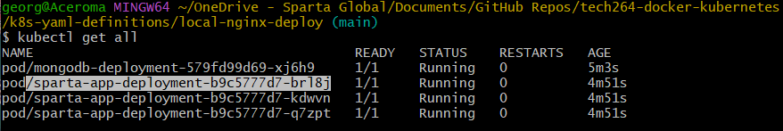
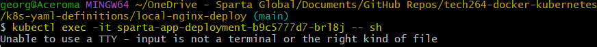

- [Kubernetes](#kubernetes)
  - [Why is Kubernetes Needed?](#why-is-kubernetes-needed)
  - [Benefits of Kubernetes](#benefits-of-kubernetes)
  - [Success Stories](#success-stories)
    - [Spotify](#spotify)
- [Kubernetes Architecture](#kubernetes-architecture)
  - [Architecture Diagram: Master Nodes and Worker Nodes](#architecture-diagram-master-nodes-and-worker-nodes)
- [Kubernetes terminology and architecture](#kubernetes-terminology-and-architecture)
  - [Pods](#pods)
  - [Deployments](#deployments)
  - [Services](#services)
  - [Nodes](#nodes)
  - [The Kubernetes control plane](#the-kubernetes-control-plane)
- [What is a Cluster?](#what-is-a-cluster)
  - [Key Components of a Kubernetes Cluster](#key-components-of-a-kubernetes-cluster)
  - [Cluster Architecture/Diagram](#cluster-architecturediagram)
- [Control Plane](#control-plane)
  - [Controller manager](#controller-manager)
  - [API Server](#api-server)
  - [Scheduler](#scheduler)
  - [etcd](#etcd)
- [Worker node components](#worker-node-components)
  - [Kubelet](#kubelet)
  - [Kube proxy](#kube-proxy)
  - [Container runtime](#container-runtime)
  - [Pods](#pods-1)
- [The Cluster Setup](#the-cluster-setup)
  - [Master vs Worker Nodes](#master-vs-worker-nodes)
  - [Managed Service vs. Launching Your Own](#managed-service-vs-launching-your-own)
    - [Pros of Managed Service](#pros-of-managed-service)
    - [Cons of Managed Service](#cons-of-managed-service)
  - [Launching Your Own](#launching-your-own)
    - [Pros of Launching Your Own](#pros-of-launching-your-own)
    - [Cons of Launching Your Own](#cons-of-launching-your-own)
  - [Control Plane (Master Node) vs. Data Plane (Worker Node)](#control-plane-master-node-vs-data-plane-worker-node)
    - [Azure Kubernetes Service (AKS) Specifics](#azure-kubernetes-service-aks-specifics)
- [Kubernetes Objects](#kubernetes-objects)
- [ReplicaSets](#replicasets)
  - [How It Works:](#how-it-works)
  - [Example](#example)
- [Pods](#pods-2)
  - [Key Points](#key-points)
    - [Group of Containers](#group-of-containers)
    - [Shared IP Address](#shared-ip-address)
    - [Ephemeral](#ephemeral)
  - [What Does It Mean When a Pod is "Ephemeral"?](#what-does-it-mean-when-a-pod-is-ephemeral)
- [What is a Volume?](#what-is-a-volume)
  - [Key Points](#key-points-1)
    - [Persistent Storage](#persistent-storage)
    - [Shared Storage](#shared-storage)
    - [Types of Volumes](#types-of-volumes)
- [Secrets in Kubernetes](#secrets-in-kubernetes)
  - [Key Points](#key-points-2)
    - [Base64 Encoding](#base64-encoding)
    - [Encryption](#encryption)
  - [Best Practices for Securing Secrets](#best-practices-for-securing-secrets)
- [Name Space](#name-space)
  - [Key Points](#key-points-3)
- [Mitigating Security Concerns with Containers](#mitigating-security-concerns-with-containers)
  - [How to mitigate security concerns with containers](#how-to-mitigate-security-concerns-with-containers)
  - [Maintained Images](#maintained-images)
  - [Key Points](#key-points-4)
    - [Pros](#pros)
    - [Cons](#cons)
- [Getting Kubernetes Running](#getting-kubernetes-running)
  - [Docker Desktop](#docker-desktop)
  - [Git Bash Window: `kubectl get service`](#git-bash-window-kubectl-get-service)
- [Code-along](#code-along)
  - [Create a Node Port Service for Nginx](#create-a-node-port-service-for-nginx)
  - [Deleting a Pod](#deleting-a-pod)
  - [Increase Number of Replicas](#increase-number-of-replicas)
  - [How to Delete Everything](#how-to-delete-everything)
- [My Interpretation of Kubernetes Architecture](#my-interpretation-of-kubernetes-architecture)
- [K8s deployment of NodeJS Sparta test app](#k8s-deployment-of-nodejs-sparta-test-app)
  - [1. Create Deployment for mongodb-deploy.yml](#1-create-deployment-for-mongodb-deployyml)
    - [Explanation](#explanation)
  - [2. Create a Service for MongoDB](#2-create-a-service-for-mongodb)
    - [Explanation](#explanation-1)
  - [3. Create Deployment YAML for NodeJS App](#3-create-deployment-yaml-for-nodejs-app)
    - [Explanation](#explanation-2)
  - [4. Create App Service](#4-create-app-service)
    - [Explanation](#explanation-3)
  - [5. Run and Verify the Deployment](#5-run-and-verify-the-deployment)
    - [Blockers](#blockers)
    - [Deletion Commands](#deletion-commands)
    - [Creation Commands](#creation-commands)
    - [Check They're There](#check-theyre-there)
  - [6. Seeding the Database](#6-seeding-the-database)
    - [Copy the app folder](#copy-the-app-folder)
    - [Explanation](#explanation-4)
- [Research Types of Autoscaling with K8s](#research-types-of-autoscaling-with-k8s)
  - [What is Autoscaling?](#what-is-autoscaling)
  - [Types of Autoscaling in Kubernetes](#types-of-autoscaling-in-kubernetes)
    - [1. Horizontal Pod Autoscaling (HPA)](#1-horizontal-pod-autoscaling-hpa)
    - [2. Vertical Pod Autoscaling (VPA)](#2-vertical-pod-autoscaling-vpa)
    - [3. Cluster Autoscaling](#3-cluster-autoscaling)
  - [Difference Between Vertical and Horizontal](#difference-between-vertical-and-horizontal)
  - [Benefits of Autoscaling](#benefits-of-autoscaling)
- [The key components of Kubernetes autoscaling](#the-key-components-of-kubernetes-autoscaling)
  - [1. Resource Request](#1-resource-request)
    - [Configuring the resource request](#configuring-the-resource-request)
    - [Pod Disruption Budget](#pod-disruption-budget)
  - [2. Pod Disruption Budget](#2-pod-disruption-budget)
  - [3. Horizontal Pod Autoscaler](#3-horizontal-pod-autoscaler)
  - [4. Cluster Autoscaler](#4-cluster-autoscaler)
    - [Adding a node](#adding-a-node)
    - [Removing a node](#removing-a-node)

<br>

# Kubernetes
* Kubernetes is a powerful tool in the world of cloud computing and software development.

## Why is Kubernetes Needed?
* Kubernetes helps in managing containers, which are small, portable environments used to run applications. 
* Managing these containers manually can become difficult, especially as you scale up with more applications or users. 
* Kubernetes automates the deployment, scaling, and operation of these containers, making it easier to manage complex applications across different servers.

## Benefits of Kubernetes
* **Scalability**: Automatically adjusts the number of containers based on application load, (provides load balancing).
* **Efficiency**: Helps you use resources (like CPU and memory) effectively, reducing costs.
* **Portability**: Applications can run in many different environments (e.g., on-premises, cloud).
* **High availability**: Keeps applications running even if some containers or servers fail.
* **Self-healing**: Automatically restarts or replaces failed containers.
* **Rollback**: Allows you to revert to a previous version of your application if something goes wrong with a new update, minimising downtime and keeping your users happy.
* **Open-source**: Being open-source, Kubernetes benefits from a large community of contributors who continuously improve and update the platform, ensuring it stays cutting-edge and reliable.
* **No single point of failure**: Distributes workloads across multiple nodes, ensuring that the failure of a single node does not bring down the entire application.

## Success Stories
* Many companies like Google, Spotify, and Shopify use Kubernetes to run applications at scale, manage high traffic, and quickly deploy new features. 
* It’s particularly popular among companies that rely on microservices architectures, where applications are split into smaller, manageable parts.

### Spotify
* **Challenge**: Spotify, a global audio-streaming platform, needed to manage its rapidly growing user base and complex microservices architecture. 
  * Initially, they used a homegrown container orchestration system called Helios, but it became clear that they needed a more robust solution supported by a larger community.

* **Solution**: Spotify decided to migrate to Kubernetes. 
  * They were attracted by Kubernetes' feature-rich environment and the strong community support. 
  * The migration allowed Spotify to benefit from increased velocity, reduced costs, and alignment with industry best practices.

Impact:
* **Improved Efficiency**: Teams could focus more on delivering features rather than managing infrastructure.
* **Autoscaling**: Kubernetes' autoscaling capabilities allowed Spotify to handle up to 10 million requests per second efficiently.
* **Reduced Provisioning Time**: Creating new services and getting them operational in production went from taking an hour to just seconds or minutes.
* **Better Resource Utilisation**: Kubernetes' bin-packing and multi-tenancy features improved CPU utilisation by two to three times.

> Spotify's successful migration to Kubernetes highlights how the platform can handle complex, large-scale applications, improve operational efficiency, and support rapid growth. This success story demonstrates the transformative power of Kubernetes in modern application management.


<br>

# Kubernetes Architecture
* Kubernetes uses a cluster setup, which is a group of connected computers (nodes) that work together.
  * **Master Node**: The brain of the cluster, controlling and managing tasks, distributing them to worker nodes.
  * **Worker Nodes**: Execute the tasks assigned by the master node by running containers.

Diagram: A simple structure of a Kubernetes architecture:

          +---------------+            +--------------------+
          |               |            |                    |
          |   Master      | ----->     | Worker Nodes       |
          |               |            |                    |
          +---------------+            +--------------------+

<br>

## Architecture Diagram: Master Nodes and Worker Nodes


Source: https://newrelic.com/de/blog/how-to-relic/what-is-kubernetes

<br>

# Kubernetes terminology and architecture


Source: https://www.cncf.io/blog/2019/08/19/how-kubernetes-works/

<br>

## Pods
* A Kubernetes pod is a group of containers that work together and share the same resources like memory and storage. 
* Each pod has one IP address that all its containers use. 
* This setup makes it easy to manage the containers as a single application.
  * **Single Container Pods**: Often, a pod has just one container, especially if the application is simple.
  * **Multi-Container Pods**: For more complex tasks, a pod can have multiple containers that share data and work together.

Example: Imagine you have a service that creates GIFs. One pod might have several containers:
* One container handles incoming requests.
* Other containers process images in the background.

This setup helps manage the application efficiently and ensures all parts work together smoothly.


Source: https://www.wallarm.com/what/what-is-a-kubernetes-pod

<br>

## Deployments
* Kubernetes deployments *define the scale* at which you want to run your application by letting you set the details of *how you would like pods replicated* on your Kubernetes nodes. 
* Deployments describe the **number of desired identical pod replicas to run** and the preferred update *strategy used when updating* the deployment. 
* Kubernetes will **track pod health**, and will **remove or add pods** as needed to bring your application deployment to the **desired state**.


<br>

## Services
* In Kubernetes, the lifetime of an individual pod is unpredictable; their **IP addresses** and **existence** can **change**. 
* In the DevOps world, servers are often treated as either "pets" (cared for individually) or "cattle" (*interchangeable*). 
* Kubernetes treats its pods like cattle, **replacing them if they fail** to ensure the application keeps running smoothly.


* A **service** in Kubernetes is an abstraction that provides a **stable interface for interacting with pods**. 
* As pods are **replaced**, their **names** and **IPs** might **change**, but the **service maintains a consistent machine name or IP address**. 
  * This way, to the outside network, everything appears unchanged, even as the underlying pods are updated or replaced.

<br>

## Nodes
* A Kubernetes node **manages** and **runs pods**; it’s the **machine** (whether virtualised or physical) that **performs the given work**. 
* Just as **pods collect individual containers that operate together**, a **node collects entire pods that function together**. 
* When you’re operating at scale, you want to be able to hand work over to a node whose pods are free to take it.

<br>

## The Kubernetes control plane
* The Kubernetes control plane is the **main entry point** for **administrators** and **users** to **manage the various nodes**. 
* Operations are issued to it either through HTTP calls or connecting to the machine and running command-line scripts. 
* As the name implies, it **controls how Kubernetes interacts with your applications**.

<br>

# What is a Cluster?
* A cluster in computing is like a team of computers working together to achieve a common goal. 
* Each computer in the cluster is called a node, and they all communicate and collaborate to run applications more efficiently and reliably.
* It allows multiple computers to work together seamlessly, providing better performance, scalability, and reliability for running applications

## Key Components of a Kubernetes Cluster
Master Node:
* **Control Plane**: This is the brain of the cluster. It manages the cluster, schedules applications, and handles the overall state of the system.
* **API Server**: Acts as the front end for the Kubernetes control plane. It exposes the Kubernetes API.
* **Scheduler**: Assigns work to the worker nodes based on resource availability.
* **Controller Manager**: Ensures the desired state of the cluster matches the actual state.
* **etcd**: A key-value store that holds all the data about the cluster's state.

Worker Nodes:
* **Kubelet**: An agent that runs on each worker node and ensures containers are running in a pod.
* **Kube-proxy**: Manages network communication inside and outside the cluster.
* **Container Runtime**: Software that runs the containers, such as Docker or containerd.

<br>

## Cluster Architecture/Diagram
* A cluster is all of the below components put together as a single unit.


Source: https://www.logicmonitor.com/support/kubernetes-control-plane-monitoring-overview

<br>

# Control Plane

## Controller manager
* The controller-manager is responsible for making sure that the **shared state of the cluster is operating as expected**. 
* More accurately, the controller manager **oversees various controllers which respond to events** (e.g., if a node goes down)

## API Server
* The API server exposes a **REST interface** to the Kubernetes cluster. 
* All **operations** against pods, services, and so forth, are **executed programmatically by communicating with the endpoints provided by it**.

## Scheduler
* The scheduler is responsible for **assigning work** to the various nodes. 
* It keeps watch over the resource capacity and **ensures that a worker node’s performance is within an appropriate threshold**.

## etcd
`etcd`

* is a distributed key-value store that Kubernetes uses to share information about the overall state of a cluster. 
* Additionally, nodes can refer to the global configuration data stored there to set themselves up whenever they are regenerated.

<br>

# Worker node components

## Kubelet
* A Kubelet tracks the state of a pod to ensure that all the containers are running. 
* It provides a heartbeat message every few seconds to the control plane. 
* If a replication controller does not receive that message, the node is marked as unhealthy.

## Kube proxy
* The Kube proxy routes traffic coming into a node from the service. 
* It forwards requests for work to the correct containers.

## Container runtime
* This is responsible for working with the containers and executing them. 
* It can be Docker or another container runtime, such as containerd or cri-o.
* It uses the container runtime interface (CRI) to communicate with the kubelet.

## Pods
* These are groups of one or more containers that share storage and network resources, and a specification for how to run them. 
* Pods are the smallest units of a Kubernetes application. 
* They can be created and managed by workload resources, such as deployments or statefulsets. 


<br>

# The Cluster Setup
* A cluster is the basic setup for Kubernetes, where multiple computers work together as a single unit. The main parts are master nodes and worker nodes:
  * **Master Node**: Responsible for controlling and scheduling tasks within the cluster. It houses the control plane, where all the decision-making happens.
  * **Worker Nodes**: Run the application workloads and communicate with the master node.

<br>

## Master vs Worker Nodes
In a cluster, there are two main types of nodes: master nodes and worker nodes.

Master Nodes:
* These are the brains of the cluster. 
* They manage and control everything that happens in the cluster. 
* The master nodes decide which tasks need to be done and assign those tasks to the worker nodes. 
* They also keep track of the overall health and status of the cluster.

Worker Nodes:
* These are the hands of the cluster. 
* They do the actual work assigned by the master nodes. 
* Each worker node runs applications and handles tasks like processing data, responding to user requests, and more. 
* Worker nodes report back to the master nodes to let them know how things are going.

> Summary
> 
> **Cluster**: A group of connected computers working together.
> 
> **Master Nodes**: Manage and control the cluster, assigning tasks to worker nodes. On average you'll want a minimum of 3. 
> 
> **Worker Nodes**: Perform the tasks assigned by the master nodes, running applications and handling workloads.

<br>

## Managed Service vs. Launching Your Own
* **Managed Service** (like Google Kubernetes Engine, Amazon EKS): 
  * Easier to set up and maintain, as the provider handles many aspects, like updates and scaling.
* **Self-Managed**: Offers full control but requires more expertise and management.

### Pros of Managed Service
* Reduces the time and effort needed to set up and maintain Kubernetes.
* Automatic updates and security patches.
* **Azure Kubernetes Service** (AKS): Simplifies deploying a managed Kubernetes cluster in Azure by offloading the operational overhead to Azure. 
  * Azure handles critical tasks like health monitoring and maintenance.

### Cons of Managed Service
* Limited customisation.
* Potentially higher costs.

<br>

## Launching Your Own
Launching your own Kubernetes service means setting up and managing your Kubernetes cluster independently, without relying on a managed service provider like Google Kubernetes Engine (GKE), Amazon EKS, or Azure Kubernetes Service (AKS).

### Pros of Launching Your Own
* **Full Control**: You have complete control over the configuration and management of your Kubernetes cluster.
  * You can customise the setup to meet specific requirements and preferences.

* **Cost Efficiency**: Potentially lower costs if you have the expertise and resources to manage the infrastructure efficiently.
  * Avoids the premium costs associated with managed services.

* **Flexibility**: You can choose your own hardware, cloud provider, or hybrid setup.
  * Freedom to use any Kubernetes-compatible tools and integrations.

* **Security**: You can implement custom security measures and policies tailored to your organisation's needs.
  * Full control over data privacy and compliance.

* **Learning and Expertise**: Provides an opportunity to gain in-depth knowledge and expertise in Kubernetes and container orchestration.
  * Valuable for teams looking to build and maintain their own infrastructure skills.

### Cons of Launching Your Own
* **Complexity**: Setting up and managing a Kubernetes cluster can be complex and time-consuming.
  * Requires a deep understanding of Kubernetes architecture and best practices.

* **Maintenance**: You are responsible for all maintenance tasks, including updates, patches, and scaling.
  * Ongoing monitoring and troubleshooting can be resource-intensive.

* **Resource Requirements**: Requires significant resources, including skilled personnel and hardware.
  * May need to invest in additional tools for monitoring, logging, and security.

* **Risk of Downtime**: Higher risk of downtime if not managed properly.
  * Requires robust disaster recovery and backup plans.

* **Support**: Limited to community support unless you invest in third-party support services.
  * May lack the immediate assistance available with managed services.


## Control Plane (Master Node) vs. Data Plane (Worker Node)
The master node works on the control plane, and the worker nodes work on the data plane. 
* **Control Plane**: The brains of the cluster, handling the scheduling, monitoring, and scaling of applications.
* **Data Plane**: Executes tasks and runs the application workloads on worker nodes.

### Azure Kubernetes Service (AKS) Specifics
Control Plane
* Azure automatically creates and configures the control plane for you at no cost. 
* The Azure platform manages the AKS control plane, which is responsible for the Kubernetes objects and worker nodes that you deploy to run your applications.

Data Plane
* The data plane consists of the worker nodes, which are Azure virtual machines (VMs) that run your applications. 
* You only pay for the AKS nodes that run your applications.

> By using AKS, you benefit from a fully managed Kubernetes service that simplifies the deployment, management, and scaling of containerised applications, allowing you to focus more on your applications and less on the underlying infrastructure.

<br>

# Kubernetes Objects
* Kubernetes manages several types of objects that define different parts of an application.
  * **Deployments**: Control how and where Pods are run, making it easy to roll out updates.
  * **ReplicaSets**: Ensure a specified number of identical Pods are running.
  * **Pods**: The smallest deployable unit, containing one or more containers.


<br>

# ReplicaSets
A ReplicaSet in Kubernetes is like a manager that ensures you always have a certain number of identical workers (called Pods) running at all times. 

* **Pods**: Think of Pods as individual workers that do a specific job in your application.
* **ReplicaSet**: The manager that keeps an eye on these workers.

## How It Works:
* **Desired Number**: You tell the ReplicaSet how many Pods you want running. For example, you might say, "I need 3 Pods running."
* **Monitoring**: The ReplicaSet constantly monitors the Pods to make sure the desired number is running.
* **Replacement**: If one of the Pods fails or stops working, the ReplicaSet will automatically create a new Pod to replace it, ensuring you always have the specified number of Pods running.

> a ReplicaSet helps maintain the stability and reliability of your application by ensuring that the right number of Pods are always up and running.

## Example
* Imagine you have a web application, and you want to make sure there are always 3 instances of it running to handle user requests. 
* You create a ReplicaSet and set the desired number of Pods to 3. 
* If one of the instances crashes, the ReplicaSet will notice and start a new instance to replace it, keeping your application running smoothly.

<br> 


Source: https://stackoverflow.com/questions/66898830/kubernetes-internal-socket-io-connection

<br>

# Pods
* A pod in Kubernetes is the smallest and simplest unit that you can create or deploy. 
  * Think of it as a tiny, self-contained environment where your application runs.

## Key Points
### Group of Containers
* A pod can contain one or more containers that share the same resources like memory and storage. 
* These containers work together as a single application.

### Shared IP Address
* All containers within a pod share the same IP address, which makes it easy for them to communicate with each other.

### Ephemeral
* Pods are temporary and can be created, destroyed, and replaced as needed. 
* If a pod fails, Kubernetes can automatically create a new one to replace it.

## What Does It Mean When a Pod is "Ephemeral"?
* Pods are ephemeral, meaning they are *temporary*. 
* If a Pod fails or is no longer needed, Kubernetes will terminate it and create a new one when necessary.

<br>

# What is a Volume?
* A way to store the data for the pods.
* A volume is a storage resource that is accessible to all containers within a pod. 
* Unlike the ephemeral storage that containers use by default (which is lost when the container stops), volumes provide a way to persist data beyond the lifecycle of individual containers.

## Key Points
### Persistent Storage
* Volumes allow data to be stored persistently, so it remains available even if the container restarts or the pod is rescheduled to a different node.

### Shared Storage
* All containers within a pod can access the same volume, making it easy to share data between them.

### Types of Volumes
* Kubernetes supports various types of volumes, such as emptyDir, hostPath, persistentVolumeClaim, configMap, and more. 
* Each type serves different use cases and storage needs.

<br>

# Secrets in Kubernetes
Secrets are encoded with base64 but this is not the same as being encrypted. 
* Secrets in Kubernetes are used to store sensitive information, such as passwords, tokens, and keys. 
* While they are encoded with base64, this encoding is not the same as encryption. 
* **Base64** encoding is simply a way to represent binary data in an ASCII string format, making it easier to handle and transmit. 
  * However, it does not provide any security or protection for the data.

## Key Points
### Base64 Encoding
* Converts binary data into a text format using a set of 64 characters. 
* This makes it easier to store and transmit data but does not secure it.

### Encryption
* Involves transforming data into a secure format that can only be read by someone with the correct decryption key. 
* This provides a higher level of security compared to base64 encoding.

## Best Practices for Securing Secrets
* **Use Encryption**: Store secrets in an encrypted format to protect them from unauthorised access.
* **Limit Access**: Restrict access to secrets to only those components and users that absolutely need it.
* **Use External Secret Management Tools**: Consider using tools like HashiCorp Vault, AWS Secrets Manager, or Azure Key Vault to manage and secure secrets outside of Kubernetes.
* **Audit and Monitor**: Regularly audit and monitor access to secrets to detect and respond to any unauthorised access.

<br>

# Name Space
* A logical way to group your resources for an application within a cluster. 
  * Think of it as a virtual boundary that helps you manage and isolate different parts of your application or different environments (like development, testing, and production).

## Key Points
* **Logical Grouping**: Namespaces allow you to group resources (like pods, services, and deployments) for an application, making it easier to manage and organise them.
* **Isolation**: They provide a level of isolation between different projects or teams, ensuring that resources in one namespace do not interfere with resources in another.
* **Default Namespace**: If you don't specify a namespace when creating a resource, it will be placed in the default namespace.

<br>

# Mitigating Security Concerns with Containers
Containers can be vulnerable, so it’s important to:
* Use maintained images (updated by trusted sources).
* Limit container permissions.
* Use security tools for scanning and monitoring containers.

## How to mitigate security concerns with containers
* **No Root Privliges**: NEVER run containers with root privileges. 
  * Running containers as root can expose your system to significant security risks. 
  * Always use the principle of least privilege.
* **Monitoring and logging**: Implement monitoring and logging of container activity. 
  * This helps detect and respond to suspicious behavior or potential security incidents in real-time. 
* **Image Scanning**: Regularly scan container images for vulnerabilities using tools like Clair, Trivy, or Aqua Security. 
  * This helps identify and fix security issues before deploying your containers.
* **Network Policies**: Implement network policies to control traffic between pods. 
  * This minimises the attack surface by restricting which pods can communicate with each other.
* **Role-Based Access Control** (RBAC): Define and control permissions within the cluster using RBAC. 
  * This ensures that only authorised users and services can access and modify resources.
* **Namespace Isolation**: Use namespaces to separate environments within the cluster for different applications or teams. 
  * This provides an additional layer of isolation and security.
* **Use Trusted Sources**: Only deploy images from reliable and secure repositories. 
  * Using maintained images from trusted sources ensures that your containers receive regular updates and security patches.

<br>

## Maintained Images
* Maintained images are container images created and updated by a trusted source, like Docker or a cloud provider. 
* They come with frequent updates, security patches, and optimisations.

## Key Points
* **Frequent Updates**: Maintained images receive regular updates to fix bugs, improve performance, and patch security vulnerabilities.
* **Trusted Sources**: These images are provided by reputable organizations, ensuring a higher level of trust and reliability.

### Pros
* **Saves Time and Effort**: Updates and patches are handled for you, reducing the time and effort needed to maintain the images.
* **Security**: Generally more secure than unmaintained images, as they receive regular security patches and updates.
* **Reliability**: Maintained images are usually tested and optimized for stability and performance, reducing the likelihood of encountering issues.
* **Community Support**: Maintained images often come with extensive documentation and community support, making it easier to troubleshoot and resolve issues.
* **Compliance**: These images are often compliant with industry standards and regulations, which can be crucial for certain applications.

### Cons
* **Limited Customisation**: May not have all the customization options you need for specific use cases.
* **Larger Size**: Could be larger in size than a custom-built image, potentially using more resources.
* **Dependency on External Updates**: Relying on external maintainers for timely updates could be risky if updates are delayed.
* **Potential Bloat**: Maintained images might include unnecessary components that you don't need, which can increase the image size and resource usage.
* **Compatibility Issues**: Sometimes, updates to maintained images can introduce compatibility issues with your existing setup, requiring additional testing and adjustments.

> Kubernetes is a powerful way to manage applications efficiently and reliably at scale. With practice, the architecture and terms will become more familiar, helping you leverage all the benefits Kubernetes has to offer.

<br>

# Getting Kubernetes Running
## Docker Desktop
* Check that your Docker Desktop is running.
  * Go to Settings.
  * Go to Kubernetes (on the left)
  * Enable Kubernetes.
  * Click "Apply and Restart"


* If you have your Docker Desktop in a large window, you will be able to check if Kubernetes is running.


<br> 

## Git Bash Window: `kubectl get service`
* Go to your Git Bash window, (you may need administration if yours is not working).
  * You can do this through the windows search bar.


* `kubectl get service`: This command lists all the services in your Kubernetes cluster.

  * Services in Kubernetes are used to expose your application running on a set of pods. 
  * They provide a stable IP address and DNS name for accessing the application, even if the underlying pods change.


`kubectl get all`
* This command lists all the resources in your Kubernetes cluster, including pods, services, deployments, ReplicaSets, and more. 
* It's a comprehensive command that gives you an overview of everything running in your cluste

<br>

# Code-along

`kubectl get deploy`


<br>

* cd into GitHub Repo folder.
  * cd tech264-docker-kubernetes
  * cd into that repo.

Make another directory: 

* `mkdir k8s-yaml-definitions`
* cd k8s-yaml-definitions
* `mkdir local-nginx-deploy`
* cd into local-nginx-deploy
* `pwd`: Path: /c/Users/georg/OneDrive - Sparta Global/Documents/GitHub Repos/tech264-docker-kubernetes/k8s-yaml-definitions/local-nginx-deploy

<br>

Make a yml file
* `touch nginx-deploy.yml`
* `ls` to check it the file is there. 

Editing on VSC
* If you go to the left side of your panel, you can see your yml file.
* Within this file, I have used Ramon's image instead of my own. 
  * daraymonsta/nginx-257:dreamteam
  * This is mine: gina98/nginx_custom_task


> You can still edit on Git Bash if you'd prefer. 

```yaml
# YAML is case sensitive
# use spaces NOT a tab when we have to indent

# Specify the API you want to use for deployment
apiVersion: apps/v1
# What kind service/object you want to create
kind: Deployment
metadata:
  name: nginx-deployment  # name the deployment
spec:
  selector:
    matchLabels:
      app: nginx # look for this label/tag to match with the k8 service

  # Create a ReplicaSet with instances pods
  replicas: 5
  template:
    metadata:
      labels:
        app: nginx
    spec:
      containers:
      - name: nginx
        image: gina98/nginx_custom_task # the image you created to run mod nginx
        ports:
        - containerPort: 80
```


* Run the file.
  * `kubectl create -f nginx-deploy.yml`

* Check it's been deployed.
  * `kubectl get deploy`


* `kubectl get replicasets`
* `kubectl get pods`


* Get them all at once:
  * `kubectl get all`


* How to delete your deployment, (use the name of the deployment at the end).
  * `kubectl delete deploy nginx-deployment`

<br> 

## Create a Node Port Service for Nginx
Three main services:
* **A Node Port**: easiest way to expose pods to the outsidw world through a port. 
  * NodePort service can use 30000-32768
* **Cluser IP**:The default type of service, which exposes the service on a cluster-internal IP. 
  * This means the service is only accessible within the cluster.
* **Load Balancer Service**: Exposes the service externally using a cloud provider's load balancer. 
  * This is useful for distributing traffic across multiple pods and ensuring high availability.

<br>

* Create a new definition file within 'local-nginx-deploy' folder. 
  * `nano nginx-service.yml`

```yaml
---
apiVersion: v1
kind: Service
metadata:
  name: nginx-svc
  namespace: default
spec:
  ports:
  - nodePort: 30001	# range is 30000-32768
    port: 80
    targetPort: 80
  selector:
    app: nginx	# this label to match service to deployment
  type: NodePort
```

* Run the file.
  * `kubectl create -f nginx-service.yml`
* Check it's been created.
  * `kubectl get services`


* Go to your local browser: localhost:30001 (this is because we have 30001 under port(s))
  * This means you've connected to one of your pods. 


<br>

## Deleting a Pod
* View your pods.
  * `kubectl get pods`

* Delete one of these.
  * `kubectl delete pod nginx-deployment-77897d64b4-7r828`

Why has it been replaced?
* Because it's self healing. 


<br> 

## Increase Number of Replicas

1. We can directly edit the deployment in real time. 
   * Use this command to search for the deployment: `kubectl get all`
   * We can use: `kubectl edit deploy nginx-deployment`
   * Change your "replicas" from 3 to 4.
   * Save and exit.


* Check if it's changed:
  * `kubectl get all`

<br>

2. Modify deployment file and apply it.
   * `nano nginx-deploy.yml`: change 3 to 5.
   * `kubectl get all`: we need to apply these changes. 
   * Create and update configs using a yaml definition:
     * `kubectl apply -f nginx-deploy.yml`


* `kubectl get all`
  * Now you can see that there are 5 pods!


<br> 

3. Use a command to increase the number of replica pods.
   * Have the number of replicas available (i.e.,5).
   * `kubectl scale --current-replicas=5 --replicas=6 deployment.apps/nginx-deployment`
   * Check: `kubectl get all`


<br>

## How to Delete Everything
It's best practise to delete things in a logical order: deploy, then service. 
* `kubectl delete -f <yaml.file>`
  * `kubectl delete -f nginx-service.yml`
  * `kubectl delete -f nginx-deploy.yml`


* The 'delete' deletes the objects but not the yaml files. 

<br> 

# My Interpretation of Kubernetes Architecture


<br>

# K8s deployment of NodeJS Sparta test app
Pre-Requisites:
* Docker image for the NodeJS Sparta test app: gina98/sparta-test-app:v1
* Database container Docker image: mongo:7.0.6

Guidance:
* Before you do it, draw a K8s architecture diagram and share it
* Copy the YAML files we already used to a new folder for this deployment, but change the file names, label/tags, images used, ports
* Deploy the app (3 replicas) without the database first, then
* Make a another deployment folder that also includes the Mongo database (1 replica)

<br>

## 1. Create Deployment for mongodb-deploy.yml
Create a yaml file called [mongo-deploy.yml](../k8s-yaml-definitions/local-nginx-deploy/mongodb-deploy.yml). This YAML script defines a Kubernetes Deployment for a MongoDB instance. 

### Explanation

1. **apiVersion**: Specifies the API version to use for the deployment. In this case, it's `apps/v1`.
2. **kind**: Specifies the kind of Kubernetes object to create. In this case, it's a `Deployment`.
3. **metadata**: Provides metadata for the deployment, including the name of the deployment (`mongodb-deployment`).
4. **spec**: Defines the specification for the deployment, including the following:
   * **selector**: Specifies the label selector to match the pods managed by this deployment. In this case, it looks for pods with the label `app: mongodb`.
   * **replicas**: Specifies the number of pod replicas to create. In this case, it creates 1 replica.
   * **template**: Defines the pod template used to create the pods. This includes:
     * **metadata**: Provides metadata for the pods, including the label `app: mongodb`.
     * **spec**: Defines the specification for the pods, including the following:
       * **containers**: Specifies the containers to run in the pods. In this case, it runs a single container with the following properties:
       * **name**: The name of the container (`mongodb`).
       * **image**: The Docker image to use for the container (`mongo:7.0.6`).
       * **ports**: Specifies the ports to expose. In this case, it exposes port `27017`.

> This script creates a Kubernetes Deployment that manages a single replica of a MongoDB pod using the mongo:7.0.6 Docker image. The pod is labeled with app: mongodb and exposes port 27017 for MongoDB connections.

<br>

## 2. Create a Service for MongoDB
Create a yaml file called [mondobg-service](../k8s-yaml-definitions/local-nginx-deploy/mongodb-service.yml). This YAML script defines a Kubernetes Service for a MongoDB instance.

### Explanation
1. **apiVersion**: Specifies the API version to use for the service. In this case, it's `v1`.
2. **kind**: Specifies the kind of Kubernetes object to create. In this case, it's a `Service`.
3. **metadata**: Provides metadata for the service, including the name of the service (`mongodb-svc`) and the namespace (`default`).
4. **spec**: Defines the specification for the service, including the following:
   * **ports**: Specifies the ports to expose. In this case:
     * **nodePort**: `30002` - The port on each node where the service is exposed.
     * **port**: `27017` - The port that the service listens on.
     * **targetPort**: `27017` - The port on the pod that the service forwards traffic to.
   * **selector**: Specifies the label selector to match the pods managed by this service. In this case, it looks for pods with the label `app: mongodb`.
   * **type**: Specifies the type of service. In this case, it's a `NodePort` service, which exposes the service on a static port on each node's IP.

> This script creates a Kubernetes Service that exposes the MongoDB instance running in the `default` namespace. The service listens on port `27017` and is accessible via the node port `30002`. The service forwards traffic to pods with the label `app: mongodb`.

<br>

## 3. Create Deployment YAML for NodeJS App
Create a yaml file called [nodejs-deploy.yml](../k8s-yaml-definitions/local-nginx-deploy/nodejs-deploy.yml). This YAML script defines a Kubernetes Deployment for your Sparta application.

### Explanation
1. **apiVersion**: Specifies the API version to use for the deployment. In this case, it's `apps/v1`.
2. **kind**: Specifies the kind of Kubernetes object to create. In this case, it's a `Deployment`.
3. **metadata**: Provides metadata for the deployment, including the name of the deployment (`sparta-app-deployment`).
4. **spec**: Defines the specification for the deployment, including the following:
   * **selector**: Specifies the label selector to match the pods managed by this deployment. In this case, it looks for pods with the label `app: sparta-app`.
   * **replicas**: Specifies the number of pod replicas to create. In this case, it creates 3 replicas.
   * **template**: Defines the pod template used to create the pods. This includes:
     * **metadata**: Provides metadata for the pods, including the label `app: sparta-app`.
     * **spec**: Defines the specification for the pods, including the following:
       * **containers**: Specifies the containers to run in the pods. In this case, it runs a single container with the following properties:
         * **name**: The name of the container (`sparta-app`).
         * **image**: The Docker image to use for the container (`gina98/sparta-test-app:v1`).
         * **ports**: Specifies the ports to expose. In this case, it exposes port `3000`.
         * **env**: Sets the environment variable `DB_HOST` to the MongoDB service's address.
         * **command**: Specifies the shell to use (`/bin/sh`) with the `-c` option to run the command provided in the `args` section.
         * **args**: Executes the following commands:
           * `cd ../app`: Changes the directory to the parent directory and then into the "app" folder.
           * `node seeds/seed.js`: Runs the Node.js script to seed the database.
           * `npm start`: Starts the application using npm.

> This script creates a Kubernetes Deployment that manages three replicas of a Sparta application pod using the gina98/sparta-test-app:v1 Docker image. The pods are labeled with app: sparta-app, expose port 3000, set the DB_HOST environment variable, and run the seed script to initialize the database before starting the application.

<br>

## 4. Create App Service
Create a yaml file called [nodejs-service.yml](../k8s-yaml-definitions/local-nginx-deploy/nodejs-service.yml). This YAML script defines a Kubernetes Service for your Sparta application.

### Explanation
1. **apiVersion**: Specifies the API version to use for the service. In this case, it's `v1`.
2. **kind**: Specifies the kind of Kubernetes object to create. In this case, it's a `Service`.
3. **metadata**: Provides metadata for the service, including the name of the service (`sparta-app-svc`) and the namespace (`default`).
4. **spec**: Defines the specification for the service, including the following:
   * **ports**: Specifies the ports to expose. In this case:
     * **nodePort**: `30003` - The port on each node where the service is exposed.
     * **port**: `80` - The port that the service listens on.
     * **targetPort**: `3000` - The port on the pod that the service forwards traffic to.
   * **selector**: Specifies the label selector to match the pods managed by this service. In this case, it looks for pods with the label `app: sparta-app`.
   * **type**: Specifies the type of service. In this case, it's a `NodePort` service, which exposes the service on a static port on each node's IP.

> This script creates a Kubernetes Service that exposes the Sparta application running in the default namespace. The service listens on port 80 and is accessible via the node port 30003. The service forwards traffic to pods with the label app: sparta-app and directs it to port 3000 on those pods.

<br>

## 5. Run and Verify the Deployment
Run these Kubernetes commands: 
* `kubectl create -f mongodb-deploy.yml`
* `kubectl create -f mongodb-service.yml`
* `kubectl create -f nodejs-deploy.yml`
* `kubectl create -f  nodejs-service.yml`


* `kubectl get pods`: to check the status of your pods and ensure they are running.
* `kubectl get services`: to verify that your services are correctly configured and accessible.
* `kubectl get all`: to get all of the information in one. 

### Blockers
* In your nodejs-service.yml (when connecting with the database), you need to change the NodePort and it can't be the same port as the mongodb-service.yml.
* Make sure you create the mongodb-deploy.yml and mongodb-service.yml as the app needs something to connect to.

<br>

### Deletion Commands
* `kubectl delete service mongodb-svc`
* `kubectl delete service sparta-app-svc` 
* `kubectl delete deployment mongodb-deployment`
* `kubectl delete deployment sparta-app-deployment`

### Creation Commands
* `kubectl create -f mongodb-deploy.yml`
* `kubectl create -f mongodb-service.yml`
* `kubectl create -f nodejs-deploy.yml`
* `kubectl create -f nodejs-service.yml`

### Check They're There
* `kubectl get all`

<br>

## 6. Seeding the Database
* This will need to be inputted after the environment variable within 'nodejs-deploy.yml' file.

### Copy the app folder
Path for app folder:
* C:\Users\georg\OneDrive - Sparta Global\Documents\tech264-docker-app-container\app\seeds

Copy your app folder to your k8s-yaml-definitions folder (the parent directory to the local-nginx-deploy').
* Navigate to wherever your app folder is kept.
* Use the copy command:
  * `cp -r ~/OneDrive\ -\ Sparta\ Global/Documents/tech264-docker-app-container/app ~/OneDrive\ -\ Sparta\ Global/Documents/GitHub\ Repos/tech264-docker-kubernetes/k8s-yaml-definitions/`


<br>

Navigate to the [nodejs-deploy.yml](../k8s-yaml-definitions/local-nginx-deploy/nodejs-deploy.yml) file and add the command to seed your database. 

```yaml
        env:
        - name: DB_HOST
          value: "mongodb://mongodb-svc.default.svc.cluster.local:27017/posts"
        command: ["/bin/sh", "-c"]
        args: ["cd ../app && node seeds/seed.js && npm start"]
```


<br>

### Explanation
**Environment Variable** (`env`):
* **name**: `DB_HOST` - This is the name of the environment variable.
* **value**: `"mongodb://mongodb-svc.default.svc.cluster.local:27017/posts"`
  * This is the value assigned to the `DB_HOST` variable, which points to the MongoDB service running in the Kubernetes cluster at the specified address and port.

> When your application container starts, it will use this environment variable to connect to the MongoDB database at the given address. This allows your application to interact with the database without hardcoding the database URL in your application code.

**Command** (`command`):
* `command: ["/bin/sh", "-c"]`
* This specifies the shell to use for executing the command. 
* In this case, it uses the `/bin/sh` shell with the `-c` option to run the command provided in the args section.

**Arguments** (args):
* `args: ["cd ../app && node seeds/seed.js && npm start"]`
  * This specifies the command to be executed by the shell. 
  * It performs the following actions:
  * `cd ../app`: Changes the directory to the parent directory and then into the "app" folder.
  * `node seeds/seed.js`: Runs the Node.js script to seed the database.
  * `npm start`: Starts the application using npm.

<br>

# Research Types of Autoscaling with K8s

## What is Autoscaling?
* Autoscaling in Kubernetes is a way to **automatically adjust** the **number of running pods** or the **resources allocated to them** based on the **current demand**. 
* This helps ensure that your application can handle varying loads efficiently without manual intervention.

<br>

## Types of Autoscaling in Kubernetes

### 1. Horizontal Pod Autoscaling (HPA)
* **What it does**: HPA automatically adjusts the number of pod replicas in a deployment, replica set, or stateful set based on observed CPU utilisation, memory usage, or custom metrics.
* **How it works**: The HPA controller periodically checks the metrics and scales the number of pods up or down to match the desired target utilisation.
* **Use case**: Ideal for applications with fluctuating workloads, such as web servers or APIs that experience varying traffic.

### 2. Vertical Pod Autoscaling (VPA)
* **What it does**: VPA automatically adjusts the CPU and memory requests and limits for containers in a pod.
* **How it works**: VPA monitors the resource usage of pods and updates their resource requests and limits to better match the actual usage.
* **Use case**: Useful for applications where the resource requirements change over time, such as batch processing jobs or data analytics workloads.

### 3. Cluster Autoscaling
* **What it does**: Cluster autoscaling adjusts the number of nodes in a Kubernetes cluster based on the resource requirements of the pods.
* **How it works**: When there are not enough resources to schedule new pods, the cluster autoscaler adds more nodes. 
  * Conversely, it removes nodes when they are underutilised.
* **Use case**: Helps manage the overall capacity of the cluster, ensuring that there are enough resources to run all scheduled pods efficiently.



<br>

## Difference Between Vertical and Horizontal

| Feature                     | Horizontal Pod Autoscaling (HPA)                                      | Vertical Pod Autoscaling (VPA)                                      |
|-----------------------------|-----------------------------------------------------------------------|---------------------------------------------------------------------|
| **Scaling Direction**       | Scales the number of pods horizontally (increases or decreases the number of pod replicas) | Scales the resources allocated to each pod vertically (adjusts CPU and memory requests and limits) |
| **Resource Management**     | Focuses on distributing the load across multiple pods                | Focuses on optimizing the resource allocation for individual pods   |
| **Implementation**          | Requires setting up metrics to monitor and define target utilization thresholds | Requires setting up policies to monitor resource usage and adjust resource requests and limits |
| **Use Case**                | Ideal for applications with fluctuating workloads, such as web servers or APIs that experience varying traffic | Useful for applications where the resource requirements change over time, such as batch processing jobs or data analytics workloads |
| **Example**                 | Automatically adds more pod replicas to handle increased traffic for a web application | Increases memory limits for a data processing job to ensure it completes successfully |

<br>

## Benefits of Autoscaling
* **Efficiency**: Automatically adjusts resources to match demand, reducing costs and improving performance.
* **Reliability**: Ensures that applications remain responsive under varying loads.
* **Scalability**: Easily handles growth in application usage without manual intervention.

<br>

# The key components of Kubernetes autoscaling
* With this feature, you always have enough resources for the workload, and when a node becomes unhealthy it gets replaced without affecting the workload. 
* You need to provide the scheduler with information about your Pods, so it can make the right decisions when scheduling them.

The following components are needed to truly benefit from the autoscaling feature of Kubernetes;

1. Resource Request
2. Pod Disruption Budget
3. Horizontal Pod Autoscaler
4. Cluster Autoscaler



Source: https://timdepater.com/articles/kubernetes-autoscaling-components/

## 1. Resource Request
* When you configure a Pod, you specify how much of each resource it needs. 
* The most common resources to specify are CPU and memory, but there are others.

Per Pod you can specify;
* The amount of CPU & memory you expect this Pod needs; the request.
* The amount of CPU & memory you’re allowing the Pod to use; the limit.

* The scheduler takes the resource request into account when determining which node has the resources available to run this Pod. 
* When there is not a node available that would fit the Pod’s resource request, the Pod goes to the Pending state.
* The Cluster Autoscaler will notice a Pod is pending because of a lack of resources and acts upon it by adding a new node.

<br>

### Configuring the resource request
* The resource request is configured per Pod like this;

```yaml
resources:
  requests:
    cpu: "200m"
    memory: "128Mi"
```

To come up with sane values for CPU & memory you can take the following into account;
* `kubectl top pods -A` shows the actual CPU & memory usage of all Pods. 
  * Be aware that this is a snapshot of that moment, it’s better to gather this information from a monitoring system that can show the trend over a longer period.
* **CPU** is a resource that can overbooked, if the actual usage is higher than defined in the resource request then this could result in performance issues but the Pod wouldn’t get evicted because of it.
* **Memory** can’t be overbooked and is reserved based on the resources request. 
  * When a Pod is using more memory than configured and the node runs out of memory the scheduler could evict this Pod.

### Pod Disruption Budget


<br>

## 2. Pod Disruption Budget
* Pod disruption budgets allow you to configure the number of Pods that can be down simultaneously from voluntary disruptions. 
* Voluntary disruptions are mostly triggered by the application owner or cluster administrator. 
* This happens for example when a deployment is changed or a node is drained. 
* The scheduler makes sure that when it’s evicting Pods, it keeps enough Pods running from the same deployment, statefulset or other controllers to don’t exceed the Pod disruption budget.

> The cluster autoscaler is performing cluster administrator actions like draining a node to scale the cluster down. That’s why it’s important to configure these correctly when you want the cluster to autoscale and auto-heal.

Example of a Pod Disruption Budget that allows for 1 Pod to be unavailable at the same time.
```yaml
apiVersion: policy/v1beta1
kind: PodDisruptionBudget
metadata:
  name: myapp
spec:
  maxUnavailable: 1
  selector:
    matchLabels:
      app: myapp
```

<br>

## 3. Horizontal Pod Autoscaler
* With a Horizontal Pod Autoscaler, you specify which metrics decide if the number of replicas should scale up or down. 
* You can use per-Pod resource metrics like CPU and memory or custom metrics like the number of requests/second, the Pod is receiving.

Resource metrics can be defined as utilisation value, e.g.;

```yaml
metrics:
  - type: Resource
    resource:
      name: cpu
      target:
        type: Utilization
        averageUtilization: 90
  - type: Resource
    resource:
      name: memory
      target:
        type: Utilization
        averageUtilization: 90
```

* When you define the metric as utilisation value it will be calculated as the percentage of the configured resource request.

<br>

## 4. Cluster Autoscaler
* The Cluster Autoscaler is the component that adjusts the size of the node pool so that all Pods have a place to run and there are no unneeded nodes.
* On most public cloud providers it’s part of the control plane which is managed by the provider. 
  * For AWS that’s not the case, you need to deploy it yourself.

### Adding a node
* The Cluster Autoscaler will monitor the Pods and decide to add a node when a Pod needs to be scheduled and there aren’t sufficient resources for the resource request of that Pod.

This works as follows;

1. A new Pod is created
2. The scheduler reads the resource request of the Pod and decides if there are enough resources on one of the nodes.
3. If there are, the Pod is assigned to the node.
4. If there aren’t, the Pod is set to the Pending state and can’t start.
5. The Cluster Autoscaler will detect a Pod is not able to schedule due to a lack of resources.
6. The Cluster Autoscaler will determine if the Pod could be scheduled when a new node is added (it could be due to (anti-) affinity rules that the Pod still can’t schedule on the newly created node).
7. If so, the Cluster Autoscaler will add a new node to the cluster.
8. The scheduler will detect the new node and schedule the Pod on the new node.

> Note: the scheduler is not capable of moving Pods to different nodes to make room for the new Pod. This can sometimes lead to inefficient use of resources.

<br>

### Removing a node
* The Cluster autoscaler will decide to remove a node when it has low utilisation and all of its important Pods can be moved to other nodes. 
* There are a few reasons which prevent a Pod from being moved to a different node. 
* To move a Pod it needs to be evicted and a new one needs to be started on a different node.

Reasons why a Pod can’t be moved;
* The Pod has a restrictive Pod Disruption Budget.
* The Pod is part of the kube-system namespace and doesn’t have a Pod Disruption Budget, or it’s too restrictive.
* The Pod isn’t backed by a controller object (so not created by deployment, replica set, job, statefulset, etc.).
* The Pod has local storage and doesn’t have the safe-to-evict annotation.
* The Pod can’t be moved due to various constraints (lack of resources, non-matching node selectors or (anti-) affinity, safe-to-evict annotation set to false, etc.)

> The logs of the Cluster Autoscaler can tell you the actual reason, but when the Cluster Autoscaler is managed by the cloud provider you don’t always have access to that log.

<br> 

